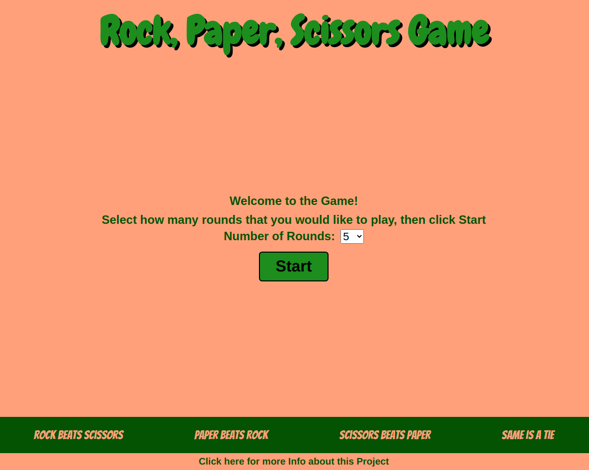
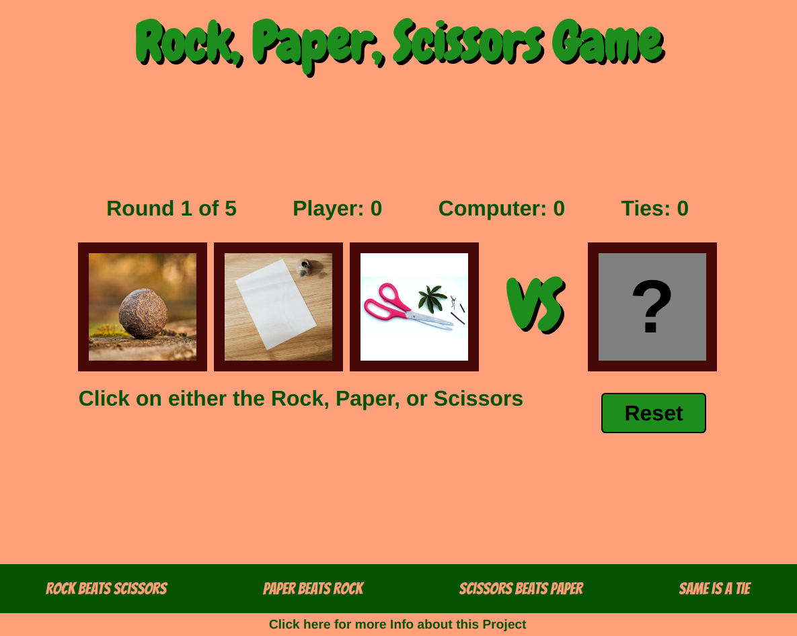
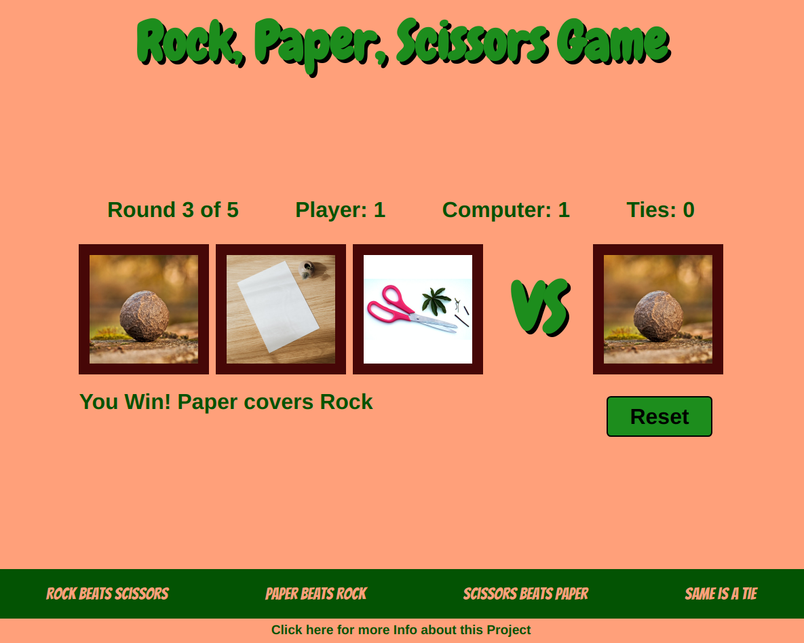
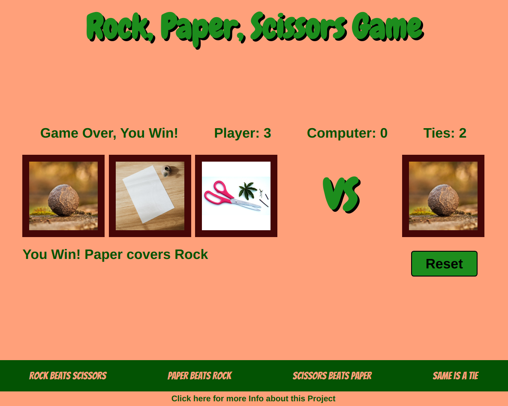
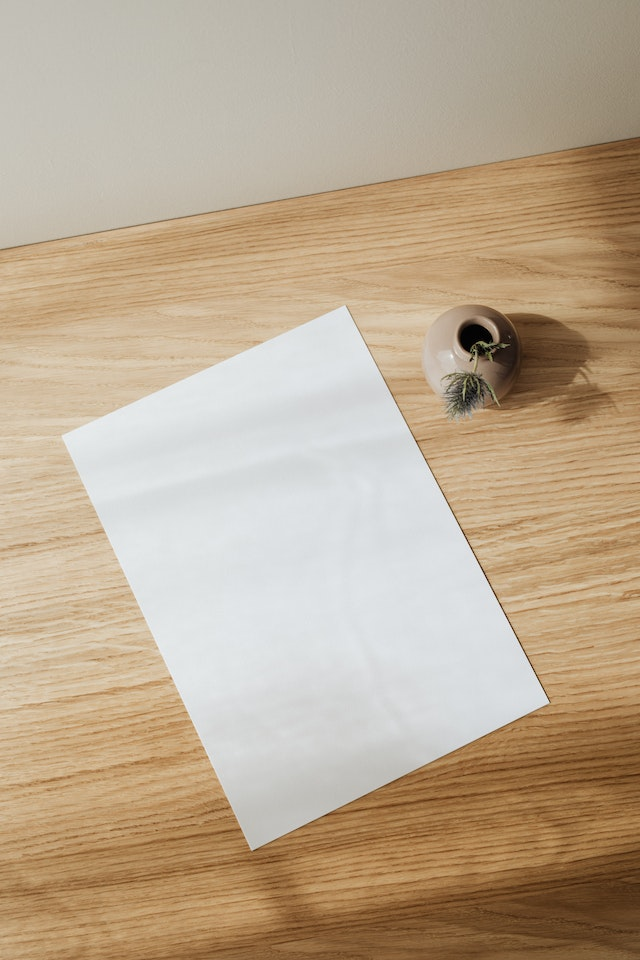
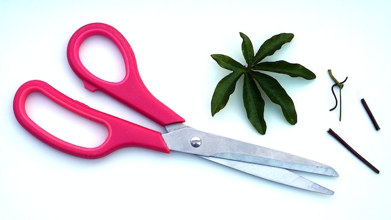

# Rock, Paper, Scissors Game

## Introduction

This [Rock, Paper, Scissors Game](https://mike-c2.github.io/odin-rock-paper-scissors) was made as a project for [The Odin Project](https://www.theodinproject.com). More specifically, these two projects:

- [Project: Rock Paper Scissors](https://www.theodinproject.com/lessons/foundations-rock-paper-scissors)
- [Revisiting Rock Paper Scissors](https://www.theodinproject.com/lessons/foundations-revisiting-rock-paper-scissors)

This project was mading using HTML, CSS, and JavaScript.

## How to Play

On the Start Page, select the number of rounds (1 to 10) that is desired to play, then click the Start button.

Once the game begins, click on either the Rock, Paper, or Scissors images on the left side. There is also a Reset button present which will remove the current game and load the Start Page again.

As each choice is made, the Computer will randomly select its own choice, and they will be evaluated to see who won.  A message declaring who won the round is displayed below the player Rock, Paper, and Scissors options. The number of points for the Player, Computer, and Ties is also updated.

After the final round is played, the game ends. A message showing whether the game was won, lost, or tied is displayed above the player Rock, Paper, and Scissors options. The player options are disabled and can no longer be clicked on. The only clickable option is the Reset button to start a new game.

## 
 

## Third Party Images used by this Project:

 

---

[Source](https://www.pexels.com/photo/empty-paper-sheet-on-wooden-table-4207708), created by [Karolina Grabowska](https://www.pexels.com/@karolina-grabowska).

 

---

[Source](https://www.pexels.com/photo/red-scissors-near-green-leaf-211710), created by [Mike Birdy](https://www.pexels.com/@mikebirdy).

 

---

[Source](https://www.pexels.com/photo/tilt-shift-lens-photography-of-stone-161702), created by [Pixabay](https://www.pexels.com/@pixabay).
